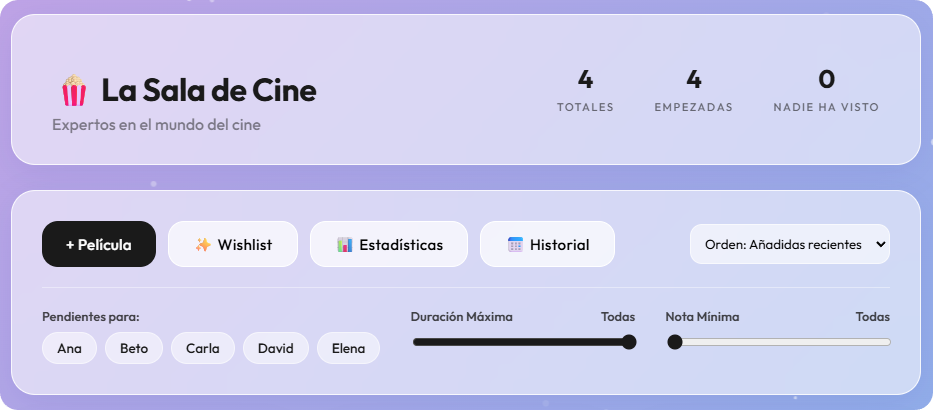

# 🍿 La Sala de Cine



Una web app moderna para organizar y gestionar películas entre amigos. Permite llevar un registro compartido de lo que se ha visto, notas, estadísticas y listas de deseos, con sincronización en tiempo real.

**🚀 Características**
- **Sincronización en tiempo real**: Los cambios se reflejan al instante en todos los dispositivos (Powered by Firebase Firestore).
- **Gestión de Películas**: Añadir, editar, puntuar y filtrar por duración/puntuación.
- **Seguimiento de Usuarios**: Marcar quién ha visto cada película y visualizar avatares.
- **Estadísticas**: Gráficos de tiempo total, top rankings y desglose por año.
- **Diseño Responsive**: Interfaz "Glassmorphism" adaptada a móviles y escritorio.
- **Wishlist Compartida**: Lista de pendientes sincronizada.

**🛠️ Configuración Local**

Este proyecto utiliza Firebase. Para ejecutarlo localmente:

1. Clona el repositorio.
2. Crea un archivo `js/firebase-config.js` (ignorado por git) con tus credenciales:
   ```javascript
   export const firebaseConfig = {
     apiKey: "TU_API_KEY",
     authDomain: "TU_PROYECTO.firebaseapp.com",
     projectId: "TU_PROYECTO",
     storageBucket: "TU_BUCKET.app",
     messagingSenderId: "TU_SENDER_ID",
     appId: "TU_APP_ID"
   };
   ```
3. Abre `index.html` en tu navegador (necesario usar servidor local por uso de módulos ES6, e.g., `python -m http.server` o Live Server).

---
Creado por **Jonathan Carrero**.
